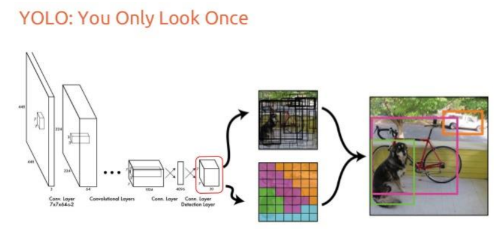
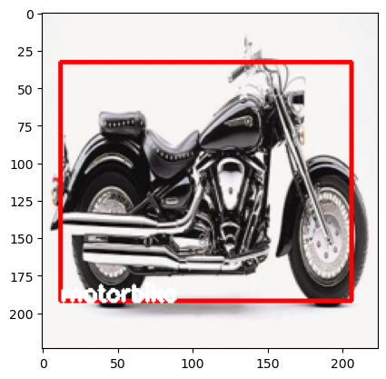
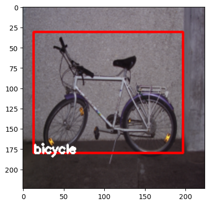
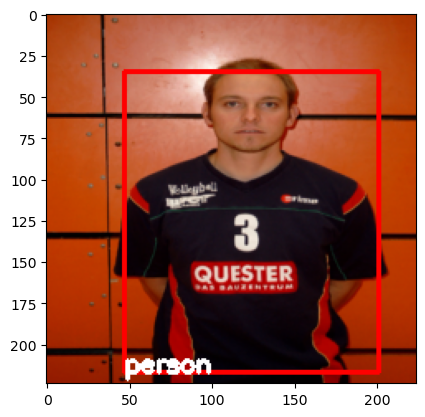
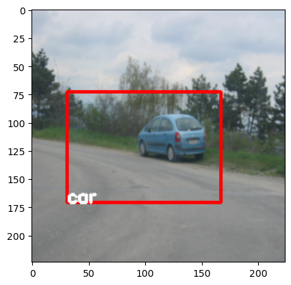

# YOLOv1 from Scratch in PyTorch

This repository contains a complete **YOLOv1 (You Only Look Once)** object detection model implemented from scratch using **PyTorch**. It follows the original YOLOv1 paper and is trained on a subset of the **PASCAL VOC 2005** dataset.

<p align="center">
  
</p>

---

## Sample Predictions (Trained for 50 Epochs on ResNet50)

<table>
  <tr>
    <td></td>
    <td></td>
  </tr>
  <tr>
    <td></td>
    <td></td>
  </tr>
</table>

<p align="center">
  
</p>

---

## Abstract

Object detection is a cornerstone of computer vision, with YOLO standing out for its **real-time performance**. In this project, I implement **YOLOv1** from scratch in PyTorch to understand its core mechanics and architecture. The model uses **ResNet50** as a backbone and incorporates a **custom YOLO loss function**, processing the **PASCAL VOC 2005** dataset for training and evaluation.

---

## Requirements

Install dependencies with:

```bash
pip install -r requirements.txt
```

---

## Dataset

- **PASCAL VOC 2005 Dataset**:
  [Download here](http://host.robots.ox.ac.uk/pascal/VOC/voc2005/index.html)

- **Supported Classes**:

  - `bicycle`
  - `car`
  - `motorbike`
  - `person`

---

## Model Architecture

### Base Network

- **ResNet50** pretrained on ImageNet is used as the feature extractor.
- Fully connected layers are removed.
- Parameters are **frozen** during training to leverage transfer learning.

### YOLO Head

- Custom convolutional layers are added on top of the ResNet backbone.
- Final output is reshaped to predict:

  - Bounding box coordinates
  - Confidence score
  - Class probabilities
    per grid cell, in a format compatible with YOLOv1.

---

## Data Processing Pipeline

- **Images** resized to **224×224**.
- **Annotations** are parsed from `.txt` files using a custom `preprocess_txt` function.
- Output labels are encoded into YOLOv1’s **S×S grid** format using a `generate_output` function.
- **Normalization** and augmentation applied using `torchvision.transforms`.

---

## Loss Function

A **custom loss function** is implemented following the YOLOv1 paper, combining four components:

- **Localization Loss**: Penalizes bounding box prediction errors.
- **Confidence Loss (Object)**: Penalizes confidence score errors when an object is present.
- **Confidence Loss (No Object)**: Penalizes false positives.
- **Classification Loss**: Ensures correct class prediction.

<!-- ### YOLO Loss Formula -->

<!-- $$
\begin{align}
\mathcal{L} &= \lambda_{\text{coord}} \sum_{i=0}^{S^2} \mathbb{1}_{i}^{obj} \left( (x_i - \hat{x_i})^2 + (y_i - \hat{y_i})^2 + (\sqrt{w_i} - \sqrt{\hat{w_i}})^2 + (\sqrt{h_i} - \sqrt{\hat{h_i}})^2 \right) \\
&+ \sum_{i=0}^{S^2} \mathbb{1}_{i}^{obj} (C_i - \hat{C_i})^2 \\
&+ \lambda_{\text{noobj}} \sum_{i=0}^{S^2} \mathbb{1}_{i}^{noobj} (C_i - \hat{C_i})^2 \\
&+ \sum_{i=0}^{S^2} \mathbb{1}_{i}^{obj} (P_i - \hat{P_i})^2
\end{align}
$$ -->

---

## Training Details

- **Backbone**: ResNet50 (pretrained)
- **Epochs**: 50
- **Batch Size**: 32
- **Optimizer**: Adam
- **Final Loss**: **6.9583**
- **Average Inference Time**: < 300ms/image
- **Hardware Used**: NVIDIA RTX 4060 GPU

---

## Evaluation

### Metric Used: **IoU (Intersection over Union)**

$$
IoU = \frac{\text{Area of Overlap}}{\text{Area of Union}}
$$

### Results

- **Overall IoU**: **58%**
- **Best performance**: Motorbike, Bicycle
- **Worst performance**: Car (due to limited samples in dataset)

## References

- [YOLOv1 Research Paper (CVPR 2016)](https://www.cv-foundation.org/openaccess/content_cvpr_2016/papers/Redmon_You_Only_Look_CVPR_2016_paper.pdf)
- [PASCAL VOC 2005 Dataset](http://host.robots.ox.ac.uk/pascal/VOC/voc2005/index.html)

---
