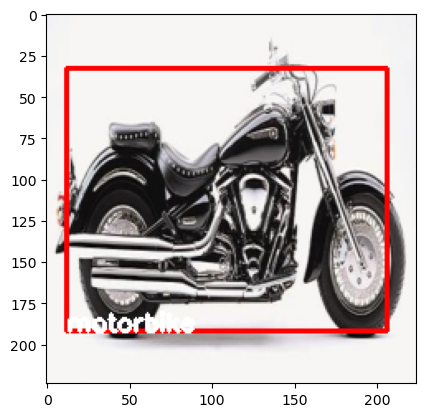
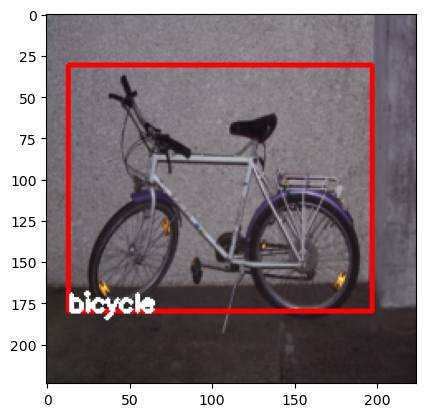
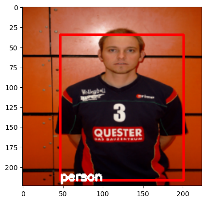
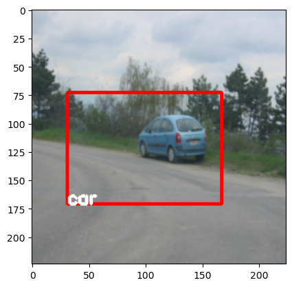

# YOLOv1 (You Only Look Once) Model from Scratch in Python

YOLOv1 is a real-time object detection deep learning algorithm. This repository contains the implementation of YOLOv1 using PyTorch.

## Some predictions (trained for 50 epochs on RESNET50):

<table>
  <tr>
    <td></td>
    <td></td>
  </tr>
  <tr>
    <td></td>
    <td></td>
  </tr>
</table>

## Requirements

- Install the required python libraries:

`pip install -r requirements.txt`

## Dataset used:

PASCAL VOC 2005 Dataset 1: http://host.robots.ox.ac.uk/pascal/VOC/voc2005/index.html

## References

YOLOv1 research paper: https://www.cv-foundation.org/openaccess/content_cvpr_2016/papers/Redmon_You_Only_Look_CVPR_2016_paper.pdf
